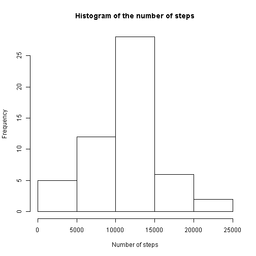
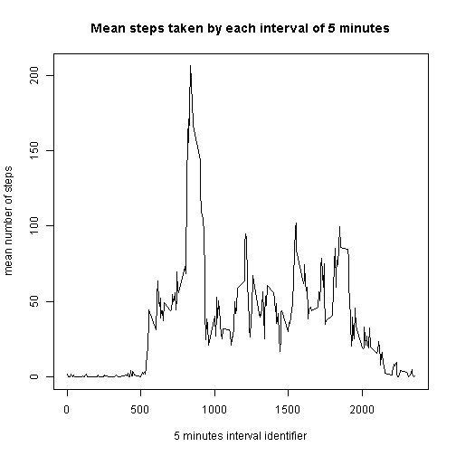
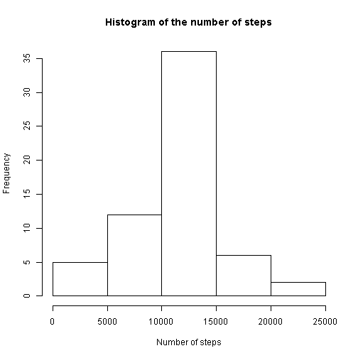
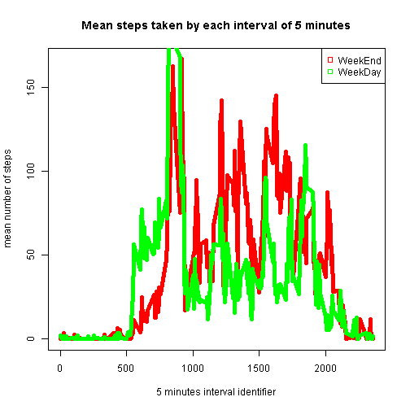

## Peer assessment 1 Reproducible Research Coursera

### Reads the libraries


```r
library("plyr")
```

### Loading and preprocessing the data

* Reads the steps data file (loads the data). 


```r
stepsData <- read.csv("activity.csv", header = TRUE)
```

### Calculating the mean total number of steps taken per day

* Plots the histogram of the number of steps

```r
hist(aggregate(steps ~ date, data = stepsData, sum)[,2],
     xlab = "Number of steps", main = "Histogram of the number of steps")
```

 

* Calculates the mean and median number of steps per day


```r
mean(aggregate(steps ~ date, data = stepsData, sum)[,2], na.rm = TRUE)
```

```
## [1] 10766.19
```


```r
median(aggregate(steps ~ date, data = stepsData, sum)[,2], na.rm = TRUE)
```

```
## [1] 10765
```

### Average daily activity pattern

* Plots the average number of steps per 5 minute interval


```r
stepsPerInterval <- aggregate(steps ~ interval, data = stepsData, mean)
plot(stepsPerInterval ,type = "l",
     main = "Mean steps taken by each interval of 5 minutes", 
     xlab = "5 minutes interval identifier", ylab = "mean number of steps")
```

 

* 5-minutes interval that contains the maximum average number of steps

```r
stepsPerInterval[stepsPerInterval[,2] == max(stepsPerInterval[,2]),1]
```

```
## [1] 835
```

### Imputing missing values

* Calculates the number of NAs

```r
dim(subset(stepsData, is.na(steps)))[1]
```

```
## [1] 2304
```

* Replaces the NAs (the strategy was to fill the NAs with average values for that interval)

```r
fillNA <- merge(stepsData[which(is.na(stepsData[,1])), ], 
                stepsPerInterval, by.x = "interval", by.y = "interval")
fillNA <- arrange(fillNA, date, interval)
```

* Creates a new dataset with the NAs filled in


```r
stepsData2 <- stepsData
stepsData2[which(is.na(stepsData[,1])), 1] <- fillNA[,4]
```

* Plots the histogram of the number of steps and calculates the 
mean and median total number of steps per day.

*The results of the mean and median are approximately the same with and without NAs.*
*The histogram presents a greater frequency on the range of 10000 to 15000 in the case without NAs*

 

```r
hist(aggregate(steps ~ date, data = stepsData2, sum)[,2],
     xlab = "Number of steps", main = "Histogram of the number of steps")
```

 


```r
mean(aggregate(steps ~ date, data = stepsData2, sum)[,2])
```

```
## [1] 10766.19
```


```r
median(aggregate(steps ~ date, data = stepsData2, sum)[,2])
```

```
## [1] 10766.19
```

### Difference between weekdays and weekend

* Create a new variable with two levels: "Weekday" and "weekend"


```r
daysOfWeek <- weekdays(as.Date(stepsData2$date),abbreviate = TRUE)

stepsData2$weekDays <- ifelse((daysOfWeek == "Sun" | daysOfWeek == "Sat"),
                              "weekend", "weekday")

stepsData3 <- aggregate(steps ~ interval + weekDays, data = stepsData2, mean)
```

* plot of comparison between the average number of steps per interval

*The weekend activity tends to be greater than weekdays on the intervals greater than 1000 and the weekend activity tends to be greater than weekdays on the intervals between 500 and aproximately 900*


```r
plot(subset(stepsData3, weekDays == "weekend")[,1],
     subset(stepsData3, weekDays == "weekend")[,3],type = "l",
     main = "Mean steps taken by each interval of 5 minutes", 
     xlab = "5 minutes interval identifier", ylab = "mean number of steps",
     col = "red", lwd = 5)
lines(subset(stepsData3, weekDays == "weekday")[,1],
      subset(stepsData3, weekDays == "weekday")[,3],type = "l",
      col = "green", lwd = 5)
legend("topright", pch = 0, col = c("red", "green"), legend = c("WeekEnd","WeekDay"))
```

 


